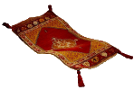

.. _authors:

============
Contributors
============

Edgar Donk

=======
Contact
=======

Any comments please forward to 

edga.donk@gmx.de

Just to anticipate what you are probably thinking - I know it's much 
too long.

Repository
==========

You should find all the python examples (mostly VPython) and the accompanying
Arduino sketches here.

`Python working with Arduino <https://github.com/Edgar-Donk/Electronic-Python/tree/master>`_

Read the Docs
=============

Where you'll find the explanations.

`Read the Docs <https://electronic-python.readthedocs.io/en/latest/>`_

More
====

Some of the trickier parts of tkinter.ttk
-----------------------------------------

.. _froth: https://frothy-brew.readthedocs.io/en/latest/index.html

.. image:: _static/frothy_brew.png
   :target: froth_

From notebook to scale, with canvas move and colour picker.

Styling with tkinter.ttk
------------------------

.. _style: https://tkinterttkstyle.readthedocs.io/en/latest/index.html

Creating your own theme using Style.

Basics and working with VPython, then create a digital gauge.

.. hint:: 

    Just click on one of the images |car| 
    
    to get whisked away on the html magic carpet.

    

