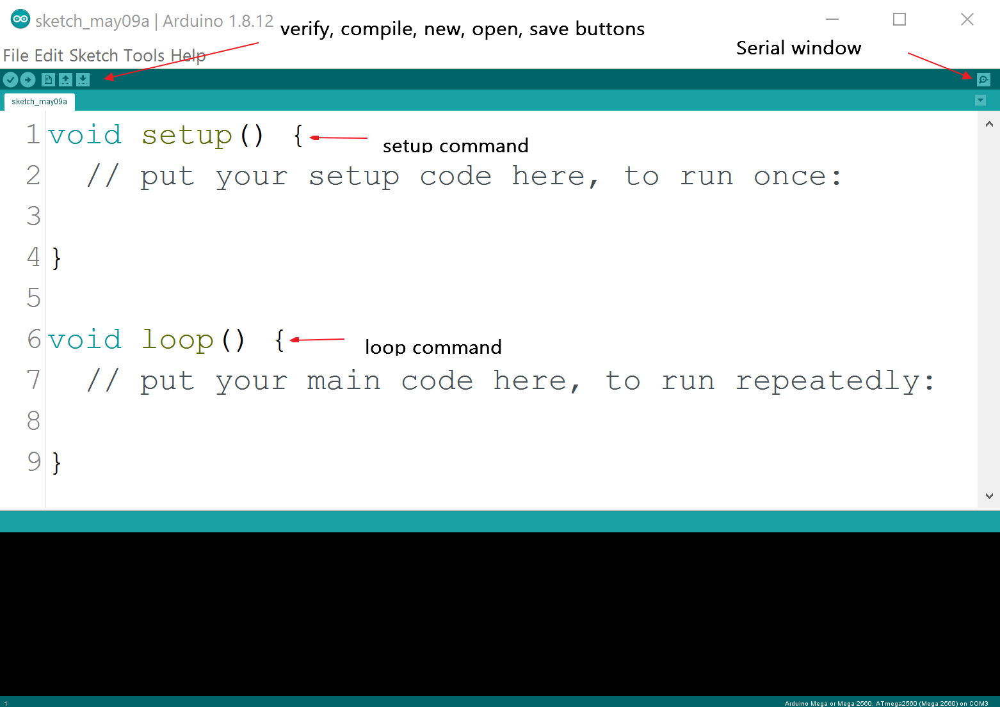

IDE Fundamentals
================

The installation and usage of the Arduino IDE is extensively documented on
the internet and with the instructions accompanying the Arduino hardware. So
taking this as read, the most important points are that this software and its
drivers are installed on your computer. Using a normal USB interface the 
board is powered and receives instructions on how to operate. Instructions 
are written in C/C++, that are compiled by the main computer and downloaded 
to the Arduino. There are a few specific methods used by the Arduino for 
interfacing with other hardware. 

.. topic:: IDE Sketch Interface

    When opening a new file standard input, setup and loop, is already given.
    Buttons are: verify, compile, new, open and save, on the right hand
    side is the serial window button, just above the new tab button.

Most of the programs written on the Arduino are necessarily small and 
contain no graphics. When interfacing with other electronic devices it is 
quite normal to use library functions, and these can be quite large. Scripts 
are called sketches and as you create and save them to disk they can be 
viewed from the IDE under File/Sketchbook. Loaded libraries will often have
examples and these can be found under File/Examples/<library name>/<example>.
As a file is saved it will be stored under a folder with the same name, each
file can be thought as a mini-project. The default Sketchbook is found under
``C:\Users\<user>\Documents\Arduino`` (similar for Mac) or ``/home/Sketchbook`` for
Linux. One of the subdirectories found there should be called ``Libraries``.

.. sidebar:: Serial Port

    You will find that it often is necessary to terminate the program by
    pulling out the usb connection, use an easily accessible port, or else
    use a male/female extension lead. Always use the same port, or else the
    wrong com port will show.

Every sketch follows a similar pattern - after documenting the program using
comments, it starts by importing the relevant library, declare the global 
constants then sets up the board by declaring the interfaces, finally it
loops through commands instructing what each interface should do. There is 
no graceful conclusion, it runs continuously until the plug is pulled.

As the programming is in C/C++ all the normal rules apply about declaring
variables with their type, either ending every command line with a semicolon
or curly bracket. Writing and reading is made through every active port, 
including the USB/serial port, see :ref:`Pin Configurations`.

If properly installed the IDE should look similar to the following, (allowing
for changes in the operating system nomenclature and the fact that I am
using a Mega 2560), your port number and Arduino type should show.

    Showing Processor and Serial Port in IDE Sketch 
    
    Click on <Tools> and look for <Board> and <Port>