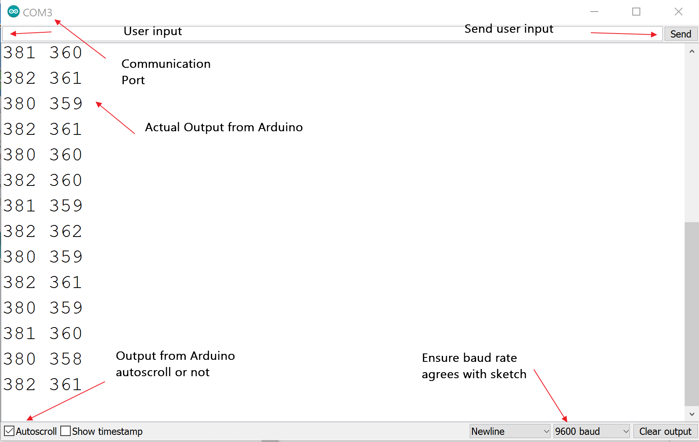
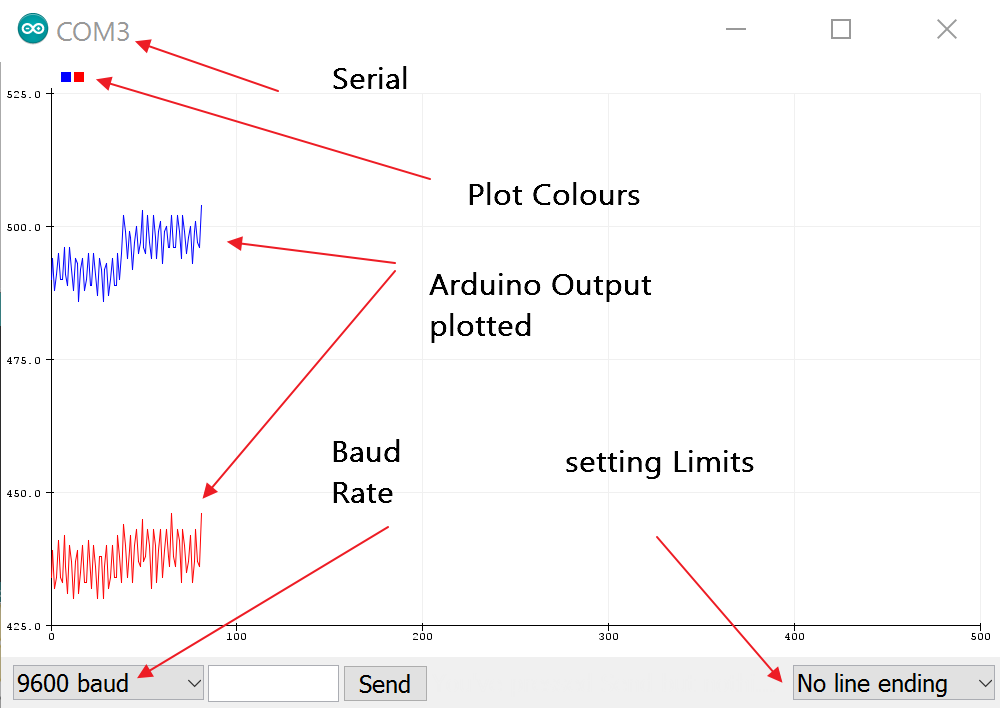

Serial Communication
====================

We will take the communication with the electronic components as a given, and 
concentrate on the serial communication. The downloading and compiling is 
already handled by the IDE requiring no special programming, all we have to 
do is connect the USB cable, check that the IDE shows the correct board
under Tools>Board, and that the Port tallies with that expected, then if the 
sketch is known to be correct, press the second button Upload, or 
Sketch>Upload. If the sketch is unknown or modified it is probably better to
first press the first button Verify, or Sketch>Verify.

Within the sketch we specify whether the results should be relayed to the 
main computer. In many instances this is required to develop systems or for
verification and troubleshooting. The IDE has two means of displaying the
information either the rightmost button Serial Monitor(Tools>Serial Monitor) 
or else Tools>Serial Plotter. These can only be activated after the board is
connected to the computer. Once running ensure that the Baud rate is set to
match that set up in the sketch. 

Serial Monitor
--------------

One can send characters back to the board in the serial monitor and add a
timestamp to the output. The serial plotter plots automatically scales to 
the output and gives the traces different colours. The latest incarnation,
1.8.12, allows one to select which basic method that a packet uses to show 
its limits.

Serial Plotter
--------------

Although useful tools both are strictly limited in their abilities, 
particularily since there is no preprogramming, and the output is not saved.

Most serial communication can be thought of as hit or miss, and may need
tuning at both ends before it becomes half way reproducible. 

At its simplest the characters sent are separated by a space, this only 
really applies to a single variable being sent. 

When monitoring multiple variables the packets are shown with a line ending, 
this applies to constant rates of sending, with the receiving end 
finishing its processing before the next packet arrives. This method of 
monitoring can require changes to the synchronised Baud rate and programmed
delays.

When information is being sent both ways through the one serial port then
it may be necessary to have a start and finish character for each packet,
such as chevrons, transmission from either end awaits the arrival of the
end of transmission, before it in-turn transmits. 

As we have seen visualisation and processing of data is strictly limited 
when we are using the Arduino IDE. This is where a third party is useful, in
particular Python.