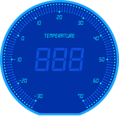
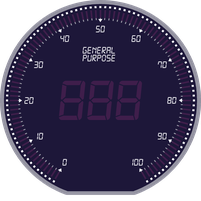
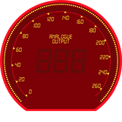
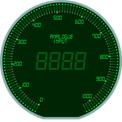

==================
Making a PIL Gauge
==================

If the tkinter drawing is too slow we can use PIL, so as not to have endless  
backgrounds I have limited the choice to four, one colour for each of the 
main ranges with a standard size. Making the background is very similar to
the tkinter gauge. When inserting the text for the gauge type, the width  
given required a different multiplier dependant on how many lines of text
was used. In order to make a better looking background it has been enlarged
then reduced.

.. container:: toggle

    .. container:: header

        *Show/Hide Code* class_pil.py

    .. literalinclude:: ../scripts/class_pil.py

You should see background images as follows:-

.. table:: Background Choices

    ================= ================= ================= =================
      Temperature          General       Analogue Output   Analogue Input
    ================= ================= ================= =================
          |70|              |100|            |255|              |1023|
    
        -30 to 70          0 to 100         0 to 255         0 to 1023
    ================= ================= ================= =================

.. container:: toggle

    .. container:: header

        *Show/Hide Code* lcd_pil.py

    .. literalinclude:: ../scripts/lcd_pil.py

After the background is saved we can retreive it and superimpose the 
displayed value and any unit description, This means that the realtime 
operations are limited, but the downside is that we need to first work with 
an image, then retreive the background image from disk, combine these two 
images before taking the result and load into tkinter to display. With so many 
image operations including a disk read the overall speed was almost 3 times
slower than using tkinter direct.

Say we open the background file, then keep it open and make a copy and use 
this copy to work with, then everytime the value changed, close the old copy 
and create a new copy. This would save the disk read, (apart from the initial
time) , we would draw on the copy, so there is no alpha composite operation. 
This in turn means we cannot use pieslice for the large ticks, but must use 
``draw_tick`` instead - this is because we cannot clean up the centres of 
background required when using pieslices.

.. container:: toggle

    .. container:: header

        *Show/Hide Code* lcd_pil_rev.py

    .. literalinclude:: ../scripts/lcd_pil_rev.py
        :emphasize-lines: 3,42-43,57,60,75-77

.. note:: Only the major changes have been highlighted, the changes needed for
    creating a class are not shown.

After all that the revised PIL script took about 60% of the time for tkinter
to draw on a canvas just the changes associated with a new value.

It should be emphasized that whether we wish to use any python program the
interface to the Arduino remains much the same, in fact we could use the
inbuilt serial window or plotter instead of the python programs. This gives
us a useful testing point, if the serial window or plotter work, then we can
use the sketch to hook up to another program.