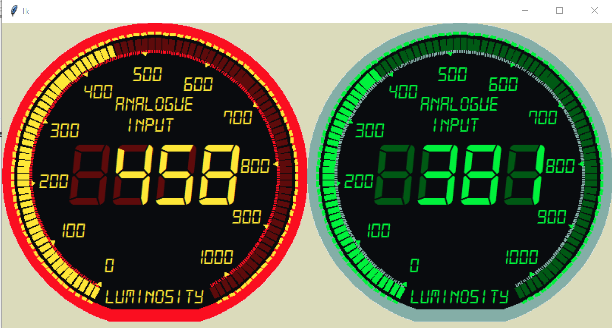

======================
Making a Tkinter Gauge
======================

As we found the output from the two LDRs (what those again) is relatively 
sedate we should have enough time to draw everything in tkinter and give the
user a colour choice.

Create a class using Canvas as the parent, so we inherit all the canvas
properties. Create a dictionary of the dependant properties, then all the 
initialised properties, then build up the gauge using the utility functions.

Tkinter Utilities
-----------------

The first utility is just a colour choice dictionary, from a colour 
selection the associated colours for highlight, background, surround and
ghost are automatically selected::

    def colour_choice(colour):
    blued={'f':'#02fdf6','b':'#0031a7','g':'#0d4fdb','s':'#18a1ff'}
    oranged={'f':'#fee737','b':'#7b0106','g':'#5E0B0B','s':'#fa0e20'} 
    greend={'f':'#00F23C','b':'#002504','g':'#005914','s':'#84aea7'} 
    purpled={'f':'#F9F9FD','b':'#1D1739','g':'#3F1E4B','s':'#9493A1'}

    if colour=='purple':
        bdial=purpled['b']
        gdial=purpled['g']
        fdial=purpled['f']
        sdial=purpled['s']

    elif colour=='blue':
        bdial=blued['b']
        gdial=blued['g']
        fdial=blued['f']
        sdial=blued['s']

    elif colour=='green':
        bdial=greend['b']
        gdial=greend['g']
        fdial=greend['f']
        sdial=greend['s']

    else:
        bdial=oranged['b']
        gdial=oranged['g']
        fdial=oranged['f']
        sdial=oranged['s']
    return bdial,fdial,gdial,sdial

Next off is a utility to draw arcs based on the centre and radius::

    # extent starts at 0 along x axis, goes anticlockwise, style PIESLICE
    def tk_arc(canvas,c,r,style,start,extent,outline='#888888',fill='#888888'):
    return canvas.create_arc([c[0]-r,c[1]-r,c[0]+r,c[1]+r],style=style,
        start=start,extent=extent,outline=outline,fill=fill)

We need a utility to draw the ticks around an arc, this means they have to 
be a line with its main axis lying along the radius. It is possible to make
the ticks wedge shaped using pieslices, but then this leaves a central part
that needs to be cleaned up. Our ticks can be tagged::

    # create tick with centre, radius, length, angle (starting 3 o' clock
    # increasing clockwise
    def tk_tick(canvas,c,ri,l,angle,fill='#888888',width=1,tags=None):
        rangle = angle * pi / 180.0
        x0 = c[0] + ri * cos(rangle)
        y0 = c[1] + ri * sin(rangle)
        x1 = c[0] + (ri + l) * cos(rangle)
        y1 = c[1] + (ri + l) * sin(rangle)
        return canvas.create_line([x0,y0,x1,y1],fill=fill,width=width,tags=tags)

Associated with ticks are deltas that should also align with the radius::

    def tk_delta(canvas,angle,c,ro,e,fill='#888888'):
        rangle = angle * pi / 180.0
        x0 = c[0] + ro * cos(rangle)
        y0 = c[1] + ro * sin(rangle)
        x1 = x0 + 2*e * sin(rangle)
        y1 = y0 - 2*e * cos(rangle)
        x2 = x0 - 2*e * sin(rangle)
        y2 = y0 + 2*e * cos(rangle)
        x3 = c[0] + (ro -3*e) * cos(rangle)
        y3 = c[1] + (ro -3*e) * sin(rangle)
        return canvas.create_polygon([x1,y1,x2,y2,x3,y3],fill=fill)

Lastly the scale range has numbers drawn on an arc adjacent to the deltas.
The figures stay in the normal orientation::

    # create text according to polar co-ordinates
    def tk_text(canvas,text,c,ro,angle,font='arial',size=12,fill='#888888',tags=''):
        rangle = angle * pi / 180.0
        x0 = c[0] + ro * cos(rangle)
        y0 = c[1] + ro * sin(rangle)
        return canvas.create_text((x0,y0),text=text,font=(font,size,'italic'),
                fill=fill,tags=tags)

Tkinter Construction
--------------------

There are about 30 variables required to be initialised, then we can 
construct the guge. Starting from the outer parts and working inwards. Make
the bezel using pieslices adding 20° to the scale extent, so start 10° less
and add 10° at the end. Clean up the central area, then add the joining line
to two ends.

Next the two rows of ticks are made, the small ticks in the highlight colour
the larger ticks in the ghost colour. Then we can make the deltas and text 
in highlight colour.

Dependant on the range add the ghost figures '888' or '8888', and add the
normal text.

Now we can start our pointer function. During the normal interreaction with
the Arduino this function is called using the value and old value, we can 
draw the larger ticks and the reading in our highlight colour. We either do
nothing, delete the large ticks or add new ticks. The display value is 
always redrawn, no matter what.

.. container:: toggle

    .. container:: header

        *Show/Hide Code* lcd_tk_dpi.py

    .. literalinclude:: ../scripts/lcd_tk_dpi.py

Finally import this into a python script that runs with our trusty 2 LDRs:-

.. container:: toggle

    .. container:: header

        *Show/Hide Code* run_lcd_tk.py

    .. literalinclude:: ../scripts/run_lcd_tk.py

If all goes well we should see the following, change the lighting and see 
how the display and larger ticks change. The gauge colour should match the
led colour.

    
    Tkinter Digital Gauges matching the LED Colours