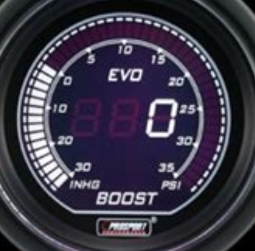

======================
Construct a Dial Gauge
======================

Alternative Dial Methods
========================

The module gaugelib, used by Ardiotech works :ref:`Ardiotech Dial Gauges`, 
but I suspect is too long. 

Plotly has some dial gauges but the application uses a Jupyter notebook - 
fine if you like that.

Half the web searches returned poor results, since a lot of applications 
think that a straight progress bar is a gauge or circular dial.

Whatever method of construction is used the result needs to be directly 
shown to the user, this is where tkinter has the advantage over PIL. One 
could use any python program that worked with and shows the result. Where I
refer to tkinter you can substitute any other GUI or for instance PyGame.
Options that spring to mind are:-
 
* Draw directly
    using tkinter canvas

* Store standard dial backgrounds 
    in a class cache, then draw a pointer.

* Draw the pointer 
    directly or with PIL using ImageTk.PhotoImage.

* Cache the pointer image 
    superimpose it on the background using PIL and its alpha composite method.

* Tag the pointer image 
    the old pointer can then be deleted while keeping the background. 
    
When using PIL the drawing operations are generally faster than canvas, but 
loading the completed image slows it down. Background images are better made 
in PIL, as we can draw on a large scale, the reduced image looks better than 
when drawn directly, especially when we wish to align the ticks with the 
scale label.

What Type of Gauge?
===================

Most dial gauges can be drawn on a small OLED display, probably with a 
package from the manufacturer. 

I thought it would be nice to make an alternative, such as the LCD display 
as used on custom cars. Although the actual product can cycle through 7 
different colour schemes, It would be best to limit the colours to say 4 
schemes where the dial is drawn at the time of use. When an image is used 
it would be best to limit the colour scheme to one for each standard scale 
range. The final result should look similar to:-

The gauge uses LCD lettering and figures, there is no separate pointer, as 
in an analogue gauge, but the large ticks are highlighted in an arc. For 
each colour scheme, we shall use 4 gauge specific colours plus a background. 
Both the large ticks and value display have "ghost colours" where they would 
be if illuminated.

When drawing for a fast application the background is loaded into the canvas,
the client is restricted to 4 utility gauges. These gauges have a single 
range choice together with its specific colour. So

* 0 to 1023 range, corresponding to Arduino analogue read, is green
* 0 to 255 range, corresponding to Arduino analogue write, is red
* 0 to 100 range, corresponding to a general purpose, is purple
* -30 to 70, corresponding to ambient temperature, is blue

If we are creating the scale using canvas for the whole operation, then the
user can mix and match between scales and colour schemes.

In both cases the value and large ticks are changed using canvas.

.. topic:: Fonts for LCD Display

    To give the gauge an authentic feel use a custom font that displays like
    a 7 section LCD. The font should be monospaced and italic (slanting). 
    The font I used was Digital-7 Mono, make sure that the font displays
    like a true LCD and has a negative sign. Once downloaded extract and, in
    the case for Windows, move into the C:\Windows\Font directory, it should
    automatically become a font for the system.
    
    When working with PIL use the font file name with the suffix `ttf` this
    is then loaded using `ImageFont.truetype(font+'.ttf', size=size)` where
    font is `digital-7 (mono italic)`. In tkinter the same font was referred
    to by the name `Digital-7 Mono`, within `font=(tkfont,10*3,'italic')`. 
    In order to view all the font names and their internal aliases use this
    script.
    
    .. code-block:: python
    
        from glob import iglob
        from PIL import ImageFont

        ttf = ImageFont.truetype(font="c:/Windows/Fonts/cour.ttf")
        ttf.getname() # --> ('Courier New', 'Regular')

        for fn in iglob("c:/Windows/Fonts/*.*"):
            try:
                ttf = ImageFont.truetype(font=fn)
                print("FT {}: {}".format(fn, ttf.getname()))
            except Exception as e:
                print("XX {}: {}".format(fn, e))
                
    It also highlights those fonts that will not display. The script found
    our font, we need only use the second result.
    
    * FT c:/Windows/Fonts\digital-7 (italic).ttf: ('Digital-7 Italic', 'Italic')
    * FT c:/Windows/Fonts\digital-7 (mono italic).ttf: ('Digital-7 Mono', 'Italic')
    * FT c:/Windows/Fonts\digital-7 (mono).ttf: ('Digital-7 Mono', 'Mono')
    * FT c:/Windows/Fonts\digital-7.ttf: ('Digital-7', 'Regular')
    
    It will be necessary to accurately align the text, polar coordinates have
    been used for the scale labels. PIL uses a handle in the upper left 
    corner. We wish to accurately centre this to within a pixel. Using PIL
    getsize() we can find not only the width and height but the offset_x and 
    offset_y of the text applying our font with its fontsize. 
    
    Luckily tkinter already uses the centre of the text for its handle. 
    Unfortunately tkinter has a different notion of pixel size compared to 
    PIL. 
    
    When running canvas in a standard IDE, such as Spyder or Thonny, 
    the results look nothing like when running from the system, Idle or
    PyScripter.
    
    .. figure:: ../figures/pyscripterLCD.png
        :width: 227px
        :height: 243px
        :alt: digital gauge using python idle
        :align: center
    
        An LCD gauge as shown by PyScripter, or system.
        
    .. figure:: ../figures/thonnyLCD.png
        :width: 101px
        :height: 116px
        :alt: digital gauge drawn on python IDE
        :align: center
    
        Exactly the same script as shown in some IDEs. 
        
        The canvas has shrunk but the fonts are as before.
    
    The above was a result of using an Ultra High Definition monitor and
    the program not being DPI aware (dots per inch), further information can 
    be found at `Frothy Brew <https://frothy-brew.readthedocs.io/en/latest/dpi_aware.html>`.

Saving the Output
-----------------

During programming it often helps to inspect the output in an image file. 
Canvas is limited in what it can do, it can only save as a Postscript file, 
which is not everyone's cup of tea. On top of that the image is saved to 
file in a reduced size, 75% of original. If instead of saving to disk we can 
capture the postscript output in PIL.::

    ps = canvas.postscript(colormode='color',pagewidth=w-1,pageheight=h-1)
    img = Image.open(BytesIO(ps.encode('utf-8')))
    img.save('my_image.png')

I found this method better than drawing in parallel or using ImageGrab (also
PIL). ImageGrab was sometimes difficult to align with the canvas, and often 
it showed the underlying layers.

As we now can save to an enlarged image file it is easy to check whether all 
is as expected, down to a pixel.

The final output is as a tkinter canvas which allows it to display while
the serial connection part of the program runs. Instead of using Frame as
the parent of an inherited class, we can use Canvas since no other widgets 
need be positioned within our gauge, frame is not called while building the 
gauge. When inheriting from canvas the gauge appears as a circular widget 
rather than a rectangular widget. 

Angles
------

Be careful when working with angles, in particular general mathematics 0°
is measured from the horizontal axis (x) and increases anti-clockwise,
so 90° is vertically upwards along the y axis. 

When designing a gauge the start and sweep angles affect its appearance, 
many gauges are based on the 300° sweep angle starting at 120° (240° 
mathspeak). This means that the end angle is 420=300+120 which is 60° 
(420-360) or 300° in mathspeak . When calculating it is useful to begin with 
the starting angle adding the ticks all the way to the end in one go using a 
single range, there is no need to calculate up to 360° then restart at 0°.

Resolution
----------

When working with ticks the smallest size we can use is 1 pixel, so the 
gauge dimensions, size and tick number must take this into consideration. 
Say we took a 200 sized dial the centre is at 100,100. The inner radius of 
the ticks are 60% of the centre dimension. As each tick must be a minimum of 
1 wide and 1 space we can see that we have to be careful about the final 
result.

