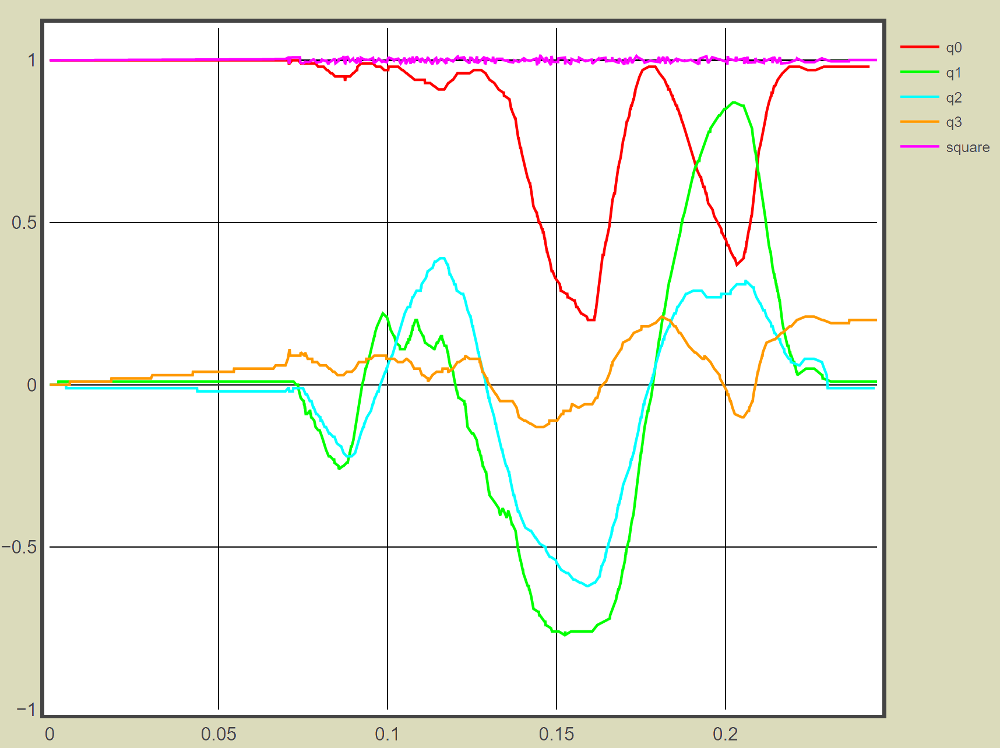
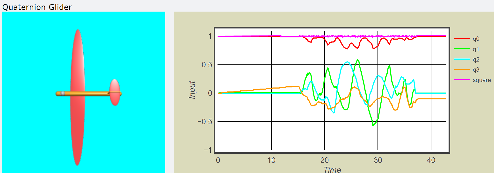

===========
Quaternions
===========

Quaternion Theory
=================

These are complex (real and imaginary) numbers in 3D space, they are made up 
from four real numbers q0,q1,q2 and q3 and three imaginary numbers i,j and 
k::

    q = q0 + iq1 + jq2 + kq3

Think of i, j and k as being mutually orthogonal imaginary vectors of unit
length. As in a complex number ``i`` represents the square root of -1, so
j and k are also the square root of -1. This means that::

    ii = -1
    jj = -1
    kk = -1

Nothing strange here, but what happens when different imaginary numbers are
multiplied together?::

    ij = k      -- (1)
    ji = -k     -- (2)
    ij = -ji    -- (3) follows from (1) and (2)
    ijk = -1    -- (4) follows from (1) times k

The normalized quaternion has unit length, so if q0² + q1² + q2² + q3² equals
1 then we have a normalized quaternion - we needn't take the square root 
since the square root of 1 is 1.

.. sidebar:: Gimbal Lock

    Plot sin or cos against an angle and you obtain a continuous curve, try
    that with tan and you will see two discontinuities at +90° and -90°. It
    becomes difficult to determine what is happening close to these angles.
 
There are all sorts of conversions given for quaternion to Euler, Yaw Pitch 
and Roll out there, but this begs the question what about position vectors
as in VPython. Some advocate changing to ypr then convert again to a vector. 
In the meantime any advantage of using quaternions to eliminate gimbal lock 
is lost.

Visualising the Quaternion
==========================

First of all modify the sketch MPU6050_DMP6 so that we are reading 
quaternions. Save as MPU6050_DMP6Quaternion and our results look like the
following:-

.. container:: toggle

    .. container:: header

        *Show/Hide Code* MPU6050_DMP6Quaternion.ino

    .. literalinclude:: ../sketches/MPU6050_DMP6Quaternion/MPU6050_DMP6Quaternion.ino

Running this you should see something like the following:-

.. container:: toggle

    .. container:: header

        *Show/Hide Code* quat.txt

    .. literalinclude:: ../examples/quat.txt

First you should see the feedback about the start up of the IMU, then numbers
to show the quaternions at the start, q0 is at 1.0 and the others are 0.0. 
The results look promising and would benefit from a customised plot from
VPython. Import vpython, and serial. Set up the graph so that it is not
fast, set the limits to y, the size and background colour. We expect that y 
will lie between 1 and -1, since both q0 and the sum of the squares start at 
1.0 where we add a small clearance. Set a colour and name for each of the 
label variables.  

    
    Plotting the quaternion in vpython

.. sidebar:: Using the While Loop

    the first while loop could have been ``while True`` or ``while 1 == 1``,
    neither are particularly clever, but they do allow us to run continuously.
    By using ``while 'esc' not in keysdown()`` we can shut off the python 
    IDE gracefully, while still having a continuous loop. The ``esc`` key
    works when the cursor is over the canvas.

We want the data to be read continuously, even when the data is not yet 
ready so the first while loop - without it the python program gets kicked 
out. The second while loop checks that there is data waiting for us, the
data is then parsed and we calculate the square of the inputs. Each input 
and the squared data is plotted against t.

After the readiness information the plotting begins, while the web page is 
being created you should see the q0 and square plots running at 1.0, the 
other 3 plots will be at 0.0. Pick up the module wave it around twisting and
turning. It should plot continuously even when the module is turned upside
down. What is noticeable is that once plotting there is not a lot of false 
data being generated, or at least detected, unlike yaw, pitch and roll. The 
data shows that the quaternions are normalised and produces stable data, but 
also the output does not precess when at rest.

It may take a try or two before it works, normally due to false data being 
detected when the computer and Arduino are not yet fully synchronised.

.. container:: toggle

    .. container:: header

        *Show/Hide Code* plot_quaternion.py

    .. literalinclude:: ../scripts/plot_quaternion.py

Rotating an enDAQ Sensor
------------------------

Using quaternions gimbal lock is no longer with us. The enDAQ sensor can 
transmit wirelessly, so the results are shown in this small video. The 
output is shown when rotating around all three axes.

    
    Quaternion Rotating about all 3 Axes `Pete Scheidler <https://blog.endaq.com/quaternions-for-orientation>`_

Now he rotates about a single axis 3 times, the results are plotted against
Euler angles. If he had used Euler angles directly there would have been
discontinuities at 180° and -180°, instead of the sinusoidal curves shown.

    
    Quaternion Rotating one axis 3 times
    
Axis-Angle to Quaternion 
-------------------------

Refer to `Rotation Quaternions, and How to Use Them <http://danceswithcode.net/engineeringnotes/quaternions/quaternions.html>`_

According to the Euler rotation theorem any 3D rotation (or sequence of 
rotations) can be specified using two parameters: a unit vector that defines 
an axis of rotation and an angle ϴ describing the magnitude of the rotation 
about that axis.

An axis-angle rotation can therefore be represented by four numbers as in 
following equation::

    (θ, x̂, ŷ, ẑ)

where (x̂, ŷ, ẑ) is a unit vector that defines the axis of rotation

A rotation quaternion is similar to an axis-angle representation. If we know 
the axis-angle components (θ, x̂, ŷ, ẑ), we can convert to a rotation 
quaternion q as follows:: 

    q = (q0, q1, q2, q3)
 
    where q0=cos(θ/2)
    q1=x̂sin(θ/2)
    q2=ŷsin(θ/2)
    q3=ẑsin(θ/2)

From these equations we can see that the real term of the quaternion (q0) is 
completely determined by the rotation angle, and the remaining three 
imaginary terms (q1, q2 and q3) are just the three rotation axis vectors 
scaled by a common factor. The magnitude of a rotation quaternion (that is, 
the sum of the squares of all four components) is always equal to one. 

Convert Quaternion to Axis-Angle
--------------------------------

First extract the rotation angle q0::

    θ=2acos(q0)
    
    if is θ not equal to 0
    
    (x̂, ŷ, ẑ)=(q1/sin(θ/2),q2/sin(θ/2),q3/sin(θ/2))

The test condition is equivalent to q=(1,0,0,0) when θ is zero, and our
module has not made any movement. In this case::

    if q0 equals 1.0 
    
    θ=to 0
    (x̂, ŷ, ẑ)=(1,0,0)

The values (x̂, ŷ, ẑ) can be used as our position vector, rotation is handled 
by::

    v2 = v1.rotate(angle=theta,axis=vec(x̂, ŷ, ẑ))

Pretty straightforward - eh? 

Creating a Glider
=================

.. figure:: ../figures/glider1.png
    :width: 608
    :height: 619
    :alt: vpython glider
    :align: center
    
    Drawing a glider in VPython

The standard example, Processing teapot, shows an aeroplane, so I thought to 
make a glider.   

.. container:: toggle

    .. container:: header

        *Show/Hide Code* glider.py

    .. literalinclude:: ../scripts/glider.py

This will be the basis of our visualisation. For demonstration purposes the
glider can be turned and twisted by clicking on the right mouse button, in
the quaternion script these properties are inactivated. 

So the glider fuselage would not be a plain tube add a sphere to both ends 
of a cylinder. Add a wing, a thin ellipsoid and tailplane also made from 
a thin ellipsoid and box. The underside to the shapes have a different 
colour to the top colour, this is done automatically in vpython.

Add four sliders to show angle, and the axis x,y,z values. The angle is 
shown in degrees but is used as radians in the ``rotate`` function. Vpython 
widgets must be bound to a function, add a description of the slider and 
show its value. Further information about vpython widgets is available at
`Widgets <https://www.glowscript.org/docs/VPythonDocs/controls.html>`_.

When run the glider rotates and positions itself according to the axis 
values, if all three axis values are zero nothing happens, also ``rotate`` 
does not start unless the angle changes, just changing the axis values will 
not directly affect the output.

    
    Glider with Input for Rotate

Using the Quaternions
=====================

Create a new python script quaternion.py, this will have the glider we 
developed above (no need for the sliders) and a plot of the values.

    
    Quaternion Glider

It was found that the input values sometimes strayed beyond the upper limit,
so the inputs were constrained to be between 1.0 and -1.0, this removed most
of the false values being created. The speed was not constrained, some of
the vpython examples used ``rate(number)`` within the loop, increasing the
value then dispensing with it altogether increased the responsiveness. It is
important that the angle in ``rotate`` is the difference from the last value
and not the actual value or else the glider spins like a demented bluebottle.

If you are using ``fast=False`` in the graph, shutdown with ``esc`` then 
disconnect, place the cursor on the x-axis values, the cursor should change
to a double headed horizontal arrow, move the cursor towards the lowest 
x value. You should be able to see the hidden plots up to the origin.