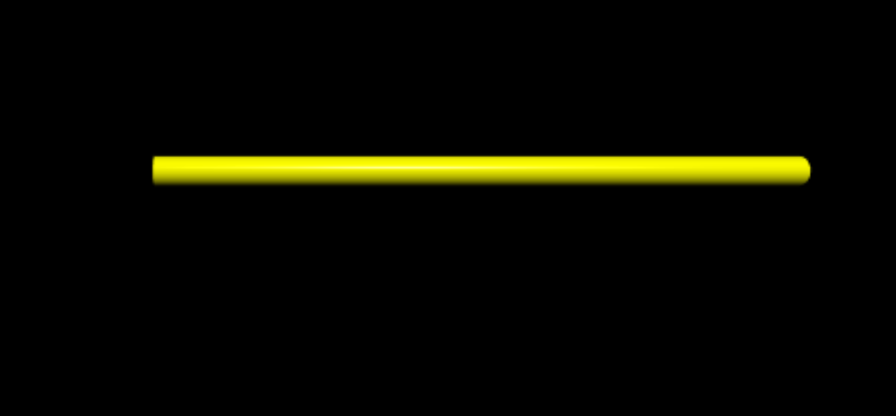
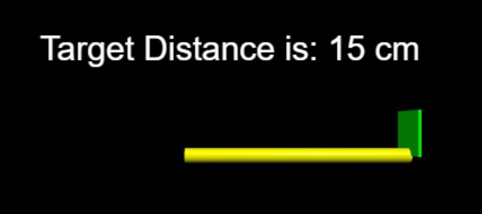
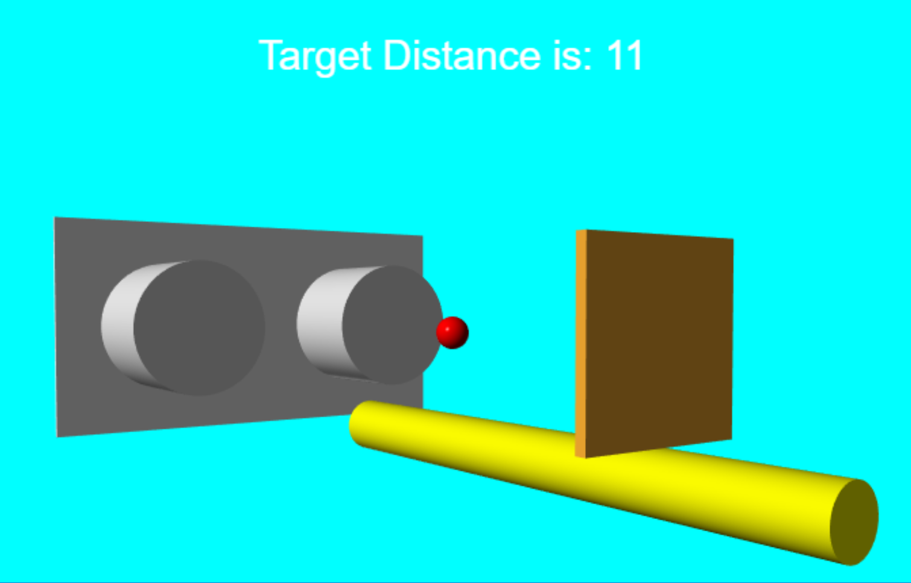

=================
Ultrasonic Sensor
=================

Sensor Overview
---------------

Before we start, just to acknowledge that the basic premise of working with
the Arduino through a serial port then to python came mainly from the 
website of `Paul McWhorter <http://toptechboy.com/using-python-with-arduino-lessons/>`_,
search through the archives to find his lessons, which cover a lot of 
different topics through the years.

The sensor is built as a module, called an HC-SR04 in my kit, it has an 
ultrasonic transmitter and receiver, a timing oscillator and 3 chips mounted 
on the rear. As a module most of the difficult part has been taken care of, 
all we need do is concentrate on the distance measuring. One can directly 
connect the module using duPont connectors (male-female) or put the pins 
carefully in the small breadboard then connect with normal wires to the 
Arduino. 

To make a meaningful test we need to know the distance based on the time 
delay between the transmitter and receiver. As ultrasonic is really just 
sound first find out the speed of sound in air.

Speed of sound 304m/s (776.5 mph) 

The ping time given by the sensor is in microseconds, therefore we can 
calculate the distance, remembering that we are measuring a round trip, so
divide by 2::

    distance = time * speed of sound / 2
    
    cm = t / 1000000 * 331.3 * 100000 / 2
    in = t / 1000000 * 741.1 * 63360 / 2

Run the Arduino Sketch
----------------------

Using the example supplied by Elgoo first install the library `<NewPing>`
then you will be able to get the distance in cm directly without having to 
do any calculation.

.. topic:: Installing a Library and using it

    The Arduino IDE has a simple way to install libraries, place the CD-Rom
    in your computer, open the Arduino IDE, then click on <Tools>/<Manage
    Libraries>, this will produce a pop-up window, enter the name of your 
    library, NewPing, in the search entry position, or scroll down, then
    click on the `install` button. 
    
    It can then be used as it is, since there should be a folder under your
    `libraries` directory called `NewPing`. 
    
    .. figure:: ../figures/newping.png
        :width: 388
        :height: 218
    
    Often the library will have examples that enlarge the scope of the 
    simple sketch generally used. These can be found by a directory
    search, or using the IDE <File>/<Examples> then picking the relevant
    heading, in our case under `Examples from Custom Libraries` <NewPing>
    and we have a choice of 6 Examples.

Starting with the basic sketch all we do is import the relevant library,
define which pins are being used for the trigger and echo, then connect to 
the library function with its input parameters. In the setup make the serial
connections, then in the loop show the output for the serial monitor::

    // ---------------------------------------------------------------------------
    // Example NewPing library sketch that does a ping about 20 times per second.
    // ---------------------------------------------------------------------------

    #include <NewPing.h>

    #define TRIGGER_PIN  12  // Arduino pin tied to trigger pin on the ultrasonic sensor.
    #define ECHO_PIN     11  // Arduino pin tied to echo pin on the ultrasonic sensor.
    #define MAX_DISTANCE 200 // Maximum distance we want to ping for (in centimeters). Maximum sensor distance is rated at 400-500cm.

    NewPing sonar(TRIGGER_PIN, ECHO_PIN, MAX_DISTANCE); // NewPing setup of pins and maximum distance.

    void setup() {
        Serial.begin(115200); // Open serial monitor at 115200 baud to see ping results.
    }

    void loop() {
        delay(50);                     // Wait 50ms between pings (about 20 pings/sec). 29ms should be the shortest delay between pings.
        Serial.print("Ping: ");
        Serial.print(sonar.ping_cm()); // Send ping, get distance in cm and print result (0 = outside set distance range)
        Serial.println("cm");
    }

.. note:: The Starter kit stated that library <HC-SR04> should be imported,
    whilst the Sensor Kit called for <NewPing>. NewPing is newer and has 
    more example files. Instead of the files having `.ino` they end in 
    `.pde`, they will load and work in the Arduino IDE without trouble. 

It can be a bit perplexing when starting that there are different libraries 
- even from the same supplier. However if in doubt one can always search
for different Arduino sketches on the internet. Using NewPing as an example 
there are a couple of folders, ``examples`` and ``src``, together with 
``keywords.txt``, ``library.properties`` and a ``readme``. Keywords highlight 
the relevant words in the sketch. Lookup `Tim Eckel's documentation <https://bitbucket.org/teckel12/arduino-new-ping/wiki/Home>`_
for a complete explanation. What this does show is that a decent library can
transform a product from a toy into something useful.

The wiring is simple so once it has been wired up test some of his examples.
If you have more than one sensor then he has a 15 (with caveats) sensor 
example. Try out his median example, which should be more accurate than the 
basic example above. Instead of wiring with 4 connections he also has an 
example using 3 connections. The theory here is that the common wire
has transmit and echo signals at different times. Just be careful about 
setting the baud rate, its 115200, 12 x 9600, so he's not dawdling::

    // a special found in his library
    #define PING_PIN  12  // Arduino pin tied to both trigger and echo pins on the ultrasonic sensor.

If you change the wiring so that only one wire comes from the trigger pin
and echo pin to one connection at the Arduino (pin 12), then change the 
sketch by deleting the 2 pin lines and substitute the above line it should
work as before.

One other point to consider, what happens when you are not working at 0°C, 
then the speed in air will be different, (Imperial units use 20°C, 68°F as
the standard temperature). A better approximation for the speed of sound is
temperature and % humidity dependant, and also to some extent pressure and
CO2 content::

    Speed of sound m/s = 331.4 + (0.606 * Temp) + (0.0124 * Humidity)

You should notice that temperature change has a greater effect than humidity
change. However it is an approximation that works well enough for the 
equipment we have to hand. Probably we'll find larger errors in the actual
measurement, after all we are dependant on two independant oscillators being
accurate enough over measurements in microseconds. The temperature
sensor should be reasonably accurate, the combined temperature and humidity
sensor DHT11 is only ±2.0°C accurate, whereas a temperature sensor DS18B20 
is accurate to ±0.5°C. The humidity is only accurate to ±5% in the combined
sensor.

Use the median example as our base method to build on.

.. container:: toggle

    .. container:: header

        *Show/Hide Code* NewPingTimerMedian.ino

    .. literalinclude:: ../sketches/NewPingTimerMedian/NewPingTimerMedian.ino

.. sidebar:: Inaccurate Readings

    First check connections, then make sure that no fluff lies on the detector 
    and receiver and baud rate is set correctly then maybe calibration will 
    help. `Arduino HC-SR04 library <https://github.com/bbkbarbar/Arduino-HC-SR04-library>`_

This is a tad more complex than the original, and should justify the 
extra code. As the output is a straight linear measure it should be possible
to check the overall accuraccy of the system. Making no temperature or 
humidity allowances the sketch showed 32cm at 30cm an accuracy within 10%,
quite good. For normal working this is good enough. Using a second module I
got much the same results - a pleasant surprise.

Visual Display HC-SR04
======================

Keep all the phsical connections in place, all we are doing is working with
graphical software. If you wish you can compare the ease of working between 
python and processing. Any testing can be made in the following manner:-

* Install Arduino software (sketch)
* Verify, before connecting Arduino to the serial port
* Compile the software
* Check that it operates on serial monitor
* Switch off monitor (most important)
* Install graphical software
* With the Arduino connected to the serial port run the graphical software

Try to use the same Arduino setup, with electronic components and compiled 
program when testing the graphical software. If necessary disconnect the 
Arduino, then reconnect it to the serial port, no further compiling is 
necessary. 

Simple Rod
----------

    
    Adjustable rod according to distance from object

One can build up on this simple drawing to make a more exciting images, but 
the principle remains largely the same. We start with our imports, then 
define any custom functions, specify our serial connection. make our image.
That completes the static part, now we have the loop setting the vpython
rate, if the serial is available read in the data, the rod length now changes 
according to the distance of the object from the ultrasonic sensor.

The rod is a simple cylinder, with a default length, which is later changed
in proportion to the distance from the object. The ``vector`` property shows 
how the rod is orientated relative to the view axes, picking up on the end 
of the rod, (-3,0,0) pushes the rod along the x-axis so that the rod's default 
centre should lie on the origin, (the other two vector properties - y and 
z axes - are 0).

.. container:: toggle

    .. container:: header

        *Show/Hide Code* ultraRod1.py

    .. literalinclude:: ../scripts/ultraRod1.py

Rod, Target and Text
--------------------

    
    Adjustable rod, target and text change with distance from object

We now include some information on the distance from the target, and a 
simple representation of the target. For test purposes we print the distance
as well as displaying it on screen. Both the rod length and target position
change with the target distance.

.. container:: toggle

    .. container:: header

        *Show/Hide Code* ultraLabel2.py

    .. literalinclude:: ../scripts/ultraRodLabel2.py

Sensor in a Scene
-----------------
 

    
    Adjustable scene target and text, change with distance from object

Change the background colour, add a representation of the ultrasonic sensor.
To make it easier to set up the rod and its adjustment place a red ball at
the origin. 

Paul McWhorter's original scripts worked at 9600 baud, remember we are using 
115200 baud, also he had an earlier version of vpython, so change the ``import
from visual`` to ``vpython`` and add ``vector`` or ``vec`` to data input::

    label(pos=(0,5,0)

becomes::

        label(pos=vector(0,5,0)

If you have a colour detector module you can add it to change the colour of
the target according to coloured paper used as the target.

    
    Using autoscale=false and right click on mouse

.. container:: toggle

    .. container:: header

        *Show/Hide Code* ultraScene3.py

    .. literalinclude:: ../scripts/ultraRodScene3.py
        :emphasize-lines: 17
