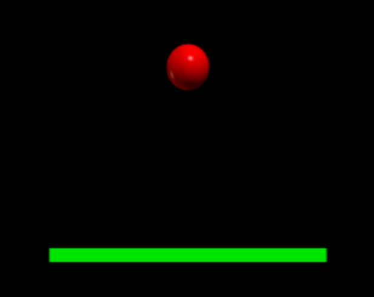
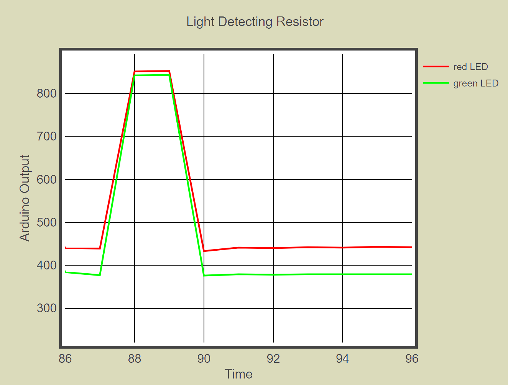
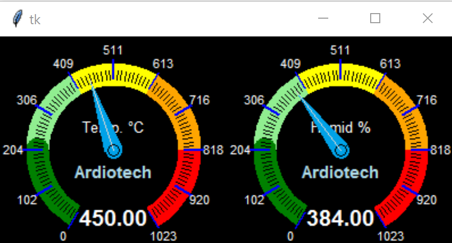

Using Vpython
=============

.. sidebar:: Information on the Web

    If an example starts with `import visual` it is the older version 6 and
    will need conversion before using.

First install vpython (version 7), simply use ``pip install vpython``. 
Vpython runs directly on a web page - it should work on a local web page 
generated on your default browser (address something like 
"http://localhost:59612").

    
    Simple demonstration of Vpython

.. code-block:: python
    :emphasize-lines: 3,4

    from vpython import *

    ball = sphere(pos=vector(0,10,0), radius=1, color=color.red)
    floor = box(pos=vector(0,0,0), size = vector(10,0.5,10), color=color.green)

    ball.velocity=vector(0,0,0)
    dt=0.01
    t=0
    g=-9.81
    while t<20:
        rate(100)
        ball.velocity.y=ball.velocity.y+g*dt
        ball.pos=ball.pos+ball.velocity*dt
        if (ball.pos.y<floor.pos.y+1.25) :
            ball.velocity.y = -ball.velocity.y
        t=t+dt

Run this from any python IDE, you should see a simple representation of a
red sphere bouncing on a green box. While the program is running move your
mouse while clicking the righthand button, then the lefthand button. Now
scroll. In just two highlighted lines the the geometry has been defined, 
most of the rest of the script is to do with the physics of the ball 
bouncing.

Just from this simple script the power of this module can be seen. Paul 
McWhorter has a whole series of tutorials on the Arduino and how it can be 
made to interact with python, in particular with vpython. Check out `"Technology Tutorials" <http://www.toptechboy.com/>`_ .

Vpython has quite a few interesting features, such as making graphs.

.. code-block:: python
    :emphasize-lines: 2,3

    from vpython import *

    gd=graph(x=400,y=500,width=600,height=600,background=color.white,
    foreground=color.black,title='Graph Tutorial',xtitle='my x-axis', 
    ytitle='my y-axis',fast=True)

    f1=gcurve(color=color.red) # gdots instead of gcurve plots single points
    t=0
    dt=0.1
    while (t<20):
        rate(100)
        f1.plot(pos=(t,sin(t)))
        t=t+dt

The plot has essentially been created in one extended line. Information on
Vpython is given at the following source `"VPythonDocs" <https://www.glowscript.org/docs/VPythonDocs/index.html>`_ .
Find graph information at `Work with 3D objects>Graphs`. In the example 
above try changing `fast=False` to the plot definition. Notice what happens
when you move the mouse over the curve.

When plotting values from the Arduino it is often useful to have a scrolling
graph.

.. code-block:: python

    from vpython import *

    gd=graph(xmin=0,xmax=10,width=600,height=600,
    ftitle='Scrolling Graph Tutorial',xtitle='my x-axis', 
    ytitle='my y-axis',fast=False,scroll=True)

    f1=gcurve(color=color.red) 
    for t in arange(0,30,0.1):
        rate(100)
        f1.plot(pos=(t,sin(t)))

Note how the script has been altered, we needed to substitute ``xmin=0,xmax=10``
for ``x=400``, add ``scroll=True`` and deleted ``y=500``. Using the built-in 
function `arange` we have been able to simplify the logic, and with ``fast=
False`` option, we can view the first part of the plot. Move the mouse 
cursor to the x-axis values, (the cursor changes from a single arrow to a
horizontal double arrow), now hold the left button down and move the mouse
leftwards to the first part of the plot.

``graph()`` contains the general data on the graph such as size, scrolling 
or not and titles, whereas ``gcurve()`` has specific plotting data such as 
color and label name (2 or more curves in one plot). plot() is how the plot 
is generated, in the example we are plotting time against a sin curve(x and 
y), in a live Arduino session this would be normally time against a read-in 
value.

We left Python Fundamentals with an unresolved python output to Two Light 
Detecting Resistors. Apart from proving that it works with the Arduino 
Serial Monitor and Serial Plotter now is a good time to provide a solution.

We connect the Arduino to the USB and start up the following Python script, 
which will print out our data.

.. code-block:: python

    import serial

    # Establish the connection on a specific port
    ser = serial.Serial('com3', 9600) 
    while True:
        # Read the newest output from the Arduino
        dataPacket=ser.readline()
        dataPacket=str(dataPacket,'utf-8')
        splitPacket=dataPacket.split(" ")
        q0=float(splitPacket[0])
        q1=float(splitPacket[1])
        print (q0,q1) 

Gave an output ::

    *** Remote Interpreter Reinitialized  ***
    353.0 382.0
    367.0 391.0
    370.0 391.0
    365.0 390.0
    371.0 391.0

Since the Arduino is sending data at about one packet every second python 
has no difficulty in keeping pace. In fact there is no need to "tune" the 
python script.

Vpython Graphing
----------------

.. code-block:: python

    from time import time
    import serial
    from vpython import *

    gd=graph(xmin=0,xmax=10,width=600,height=400,
    title='Light Detecting Resistor',xtitle='Time',
    ytitle='Arduino Output',scroll=True,fast=False)
    
    output0=gcurve(color=color.red, label='red LED')
    output1=gcurve(color=color.green, label='green LED')

    # Establish the connection on a specific port
    ser = serial.Serial('com3', 9600) 
    start = round(time())
    while True:
        # Read the newest output from the Arduino
        dataPacket=ser.readline()
        dataPacket=str(dataPacket,'utf-8')
        splitPacket=dataPacket.split(" ")
        q0=float(splitPacket[0])
        q1=float(splitPacket[1])
        
        now=round(time())
        output0.plot(pos=(now-start,q0))
        output1.plot(pos=(now-start,q1))

.. note:: from time import clock

    clock() is deprecated, now use `from time import time` for Windows, Mac 
    and Linux machines.

Use time() to provide a time line for the plot, running in seconds. The 
advantage here is that we can plot and label the curves according to the
Arduino input, so we just have to match up the sequence on the Arduino to
that of the packet used by vpython.

    
    Light shone on LCDs, we know which plot corresponds to which led

Compare this to the output using just the serial plotter, :ref:`Serial Communication`
the auto-sizing feature of the plotter creates that jagged plot output, we 
have two plots that we cannot customize, whereas vpython allows us to 
show what the plots actually are. later on we shall see how important this
can be.

Ardiotech Dial Gauges
---------------------

In some instances it would make sense to display the information as a gauge.
Making a gauge in most python guis is fairly similar, we can use the example
given by Ardiotech `Gauge using tkinter <http://www.ardiotech.com/en/gauge-tkinter-python/>`_. 
Import gaugelib and use the output from our packet to show the value
on our gauge. Astute readers will realize that we could have difficulties 
because we need to read the packet with an infinite loop and at the same 
time the gui requires its own infinite loop. Unless we are careful we shall 
have a blocking situation. If we try to resolve this with an after() call it 
remains blocked or the dial does not show. The solution given here is not
optimal, but it seems to work with this set of conditions.

.. code-block:: python

    from tkinter import Tk
    import serial
    import gaugelib

    def Packet():
        # Read the newest output from the Arduino
        dataPacket=ser.readline()
        dataPacket=str(dataPacket,'utf-8')
        splitPacket=dataPacket.split(" ")
        q0=float(splitPacket[0])
        q1=float(splitPacket[1])
        p1.set_value(int(q0))
        p2.set_value(int(q1))
        # root.after(0,Packet)

    root = Tk()
    p1 = gaugelib.DrawGauge2(
        root,
        max_value=1023,
        min_value=0,
        size=200,
        bg_col='black',
        unit = "Temp. °C",bg_sel = 2)
    p1.pack(side='left')

    p2 = gaugelib.DrawGauge2(
        root,
        max_value=1023,
        min_value=0,
        size=200,
        bg_col='black',
        unit = "Humid %",bg_sel = 2)
    p2.pack(side='right')

    ser = serial.Serial('com3', 9600)

    while 1:
        Packet()
        root.update() # no root.mainloop()

    #root.after(0,Packet)
    #root.mainloop()

The module gaugelib allows you to select the gauge type, near circular
gaugelib.DrawGauge2 or semi-circular gaugelib.DrawGauge3, dial limits, size,
background colour, the units shown on the gauge and background type.

.. topic:: Methods to unblock the GUI

    When the packet is called place update() immediately after and comment out
    mainloop(). You can try using after() with various times after uncommenting
    mainloop() and commenting out update(). 
    

If you want to experiment with different gauges, still using the LDR Arduino
script, go to :ref:`Making a Gauge in Python`.