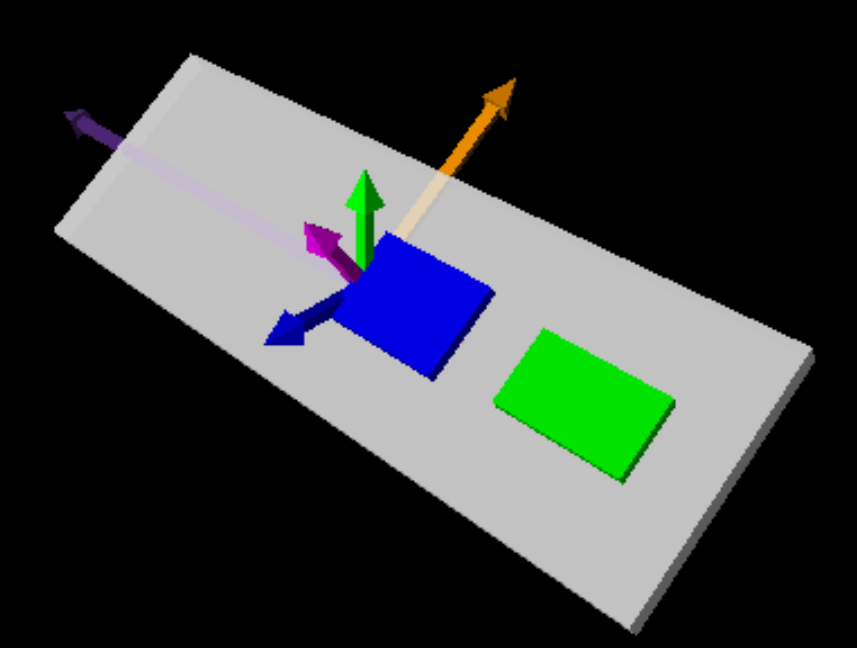

===================
Yaw, Pitch and Roll
===================

These terms can describe the attitude of the module at any given time. We 
need to convert the acceleration and gyro terms into a more understandable 
system.

.. topic:: Yaw, pitch and roll

    Imagine an aeroplane in flight, with 3 axes passing through the plane, 
    the origin lying roughly at the plane's centre of gravity. If the plane
    swings sideways, pivoting around the z axis, the amount it swings is yaw.
    Pitch occurs when the nose of the plane rises or falls, the plane rotates 
    about the y axis. Now assume the plane stays on a straight course but 
    pivots about the x axis so that the angle of the wings moves, that can 
    be called roll.

One can calculate the angles roll and pitch or else use what is already 
available:: 

    pitch = arctan(-Gx/(Gy*Gy+Gz*Gz)**0.5)

    roll = arctan2(Gy/Gz)

    where Gx, Gy, Gz are the acceleration in each axis

Yaw cannot be computed accurately from acceleration alone, so we require
gyroscope data::

    angular velocity = dθ/dt

    θ(t) ≈ sum(dθ/dt Ts)

Fuse the two sets of data together by complementary filter function (easier),
or by Kalman filter::

    pitch = 0.96 * (angle + gyroYangle / dT) +0.04 * accelYangle

    roll = 0.96 * (angle + gyroXangle / dT) +0.04 * accelXangle

    yaw = 0.96 * (angle + gyroZangle / dT) +0.04 * accelZangle

but the yaw measurement drifts, which can only be eliminated by adding a
magnetometer, unless the Digital Motion Processor (DMP) is accessed and used,
which is where Jeff Rowberg's library shines. Most of the technical stuff is
now delegated to the DMP, we can figuratively sit back and enjoy the results.

Using MPU6050_DMP6
------------------

This should have all the functions we require for yaw, pitch and roll, later 
quaternions. There is a newer sketch MPU6050_DMP6_using_DMP_V6_12 which has
problems with the Processing teapot, so stay with MPU6050_DMP6 for the moment.

It has much the same features seen in the other 2 sketches we have used. Note
that he states we should connect the external interrupt pin to 0 on the Uno
and 2 on the Mega. Also he wants 3.3V for his supply. The file we are using
has ``#define OUTPUT_READABLE_YAWPITCHROLL`` already uncommented, so we 
shall be using this first. 

Be careful about ``#define INTERRUPT_PIN 2``, the Uno has 2 x interrupt pins,
he probably means pin D2 which is interrupt 0, this happens to be the same 
for the Mega see :ref:`Table Arduino Interrupt Pins`. 

When the program asks for any character to be sent when ready, you should 
have set the baud rate before sending the character. When working with the 
serial monitor this line is a good idea, when we have a python script the 
baud rate is already set within the script.

The gyro and acceleration offsets are setup. There is a calibration time, 
after which the DMP and interrupt detection are enabled.

Running this on the serial monitor you should see something similar to the 
following:-

.. container:: toggle

    .. container:: header

        *Show/Hide Code* mpu6050_dmp6.txt

    .. literalinclude:: ../examples/mpu6050_dmp6.txt
        :linenos: 

There will be some indecipherable text on startup (line 2), change the baud 
rate to 11520, this will then show the next 4 lines and it waits for any
character and <Send> :ref:`Serial Monitor`. After making hardware checks
and resetting the memory bank it repeats the new offsets (all slightly
different - I don't know yet why), it then enables the DMP and interrupt 
detection then shows the ypr values, the output looked stable with
very little drift when the module was at rest.

We should be ready now to add a bit of python spice.

Visual Display for GY-521
-------------------------

As we have seen the output from the sketch is pretty wordy, copy the 
MPU6050_DMP6 sketch and amend it so that we just have the sketch with no 
selection between alternatives, then change the output of 
OUTPUT_READABLE_YAWPITCHROLL so that ``ybr`` call is commented out and the 
separators have been changed to commas.

.. container:: toggle

    .. container:: header

        *Show/Hide Code* MPU6050_DMP6RollPitchYaw.ino

    .. literalinclude:: ../sketches/MPU6050_DMP6RollPitchYaw/MPU6050_DMP6RollPitchYaw.ino

Before running this ensure that it verifies then compile. On the serial 
plotter you should see the bare values separated by commas.

In this script we will depict the MPU mounted on a small breadboard. To give 
a relational view use two sets of positional arrows, one set remains static
the other set move synchronously with our sensor. Make the sensor from three
boxes, make these into a compound object that will move as one. Note that
the use of the right hand mouse button is disabled to prevent the view 
changing.

The packet is parsed then the components are used in vpython to manipulate
the module and three of the arrows. Note that the trigonmetric functions 
have been directly imported from vpython.

.. container:: toggle

    .. container:: header

        *Show/Hide Code* roll_pitch_yaw.py

    .. literalinclude:: ../scripts/roll_pitch_yaw.py

    Representation of MPU module with arrows

Make sure that the serial monitor is not running, you can even shut off the
Arduino IDE before starting the python script. A new web page is made in your 
default browser and nothing much happens on the screen until the sketch has
finished initialising. Meanwhile python should be printing the startup checks,
after a warm up time the module becomes resposive. I found quite a few false
pieces of data were being trapped. 

.. container:: toggle

    .. container:: header

        *Show/Hide Code* MPU6050_DMP6RollPitchYaw.txt

    .. literalinclude:: ../examples/ybr.txt